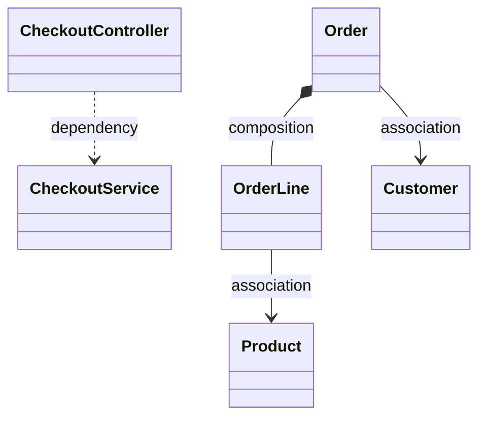
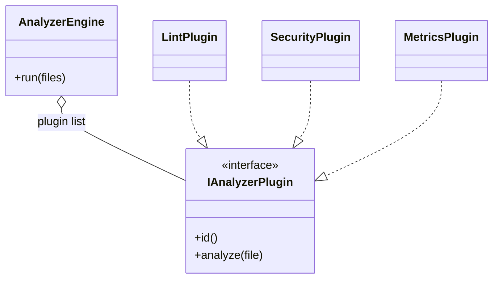

# Day 6 - UML Class Diagrams and Week 1 Capstone

**Theme:** Communicate design clearly and integrate all Week 1 concepts in end-to-end mini systems.

---

## Learning goals

By the end of this document, you should be able to:

- Read and draw core UML class relationships correctly.
- Explain ownership/lifetime with association, aggregation, and composition.
- Present integrated OOP + SOLID reasoning in capstone-style LLD answers.

---

## 1) Why UML matters in LLD interviews

UML is a communication tool, not an art contest.  
Use it to quickly show:

- Dependency direction
- Ownership/lifecycle
- Interface boundaries and extension points

Clean diagrams with clear labels are more valuable than overly detailed notation.

---

## 2) Relationship cheat sheet

### Dependency (weakest)

Temporary usage through method parameters, local variables, or return types.

- Typical notation: dashed arrow

### Association

Longer-lived structural link, often through a field reference.

- Typical notation: solid line

### Aggregation (weak ownership)

`A` has `B`, but `B` can exist independently of `A`.

- Typical notation: hollow diamond on owner side

### Composition (strong ownership)

`B` is part of `A` and lifecycle is typically tied to `A`.

- Typical notation: filled diamond on owner side

### Interview-safe rule

If lifetime ownership is unclear, use association and explain it in words rather than forcing wrong diamonds.

---

## 3) Composition vs inheritance in UML

- Inheritance models stable `is-a` specialization.
- Composition models flexible behavior assembly.

For extensible systems (plugins, strategy chains, wrappers), prefer interfaces + composition in diagrams.

---

## 4) Practice diagram: Online order system

Core relationship choices:

- `Order *-- OrderLine` (composition)
- `Order --> Customer` (association)
- `OrderLine --> Product` (association)
- `CheckoutController ..> CheckoutService` (dependency)

Reasoning: order lines are part of order lifecycle; customer/product outlive individual orders.

---

## 5) Practice diagram: Plugin analyzer

Target design:

- `AnalyzerEngine` depends on `IAnalyzerPlugin` abstraction
- Concrete plugins implement interface
- New plugin added without engine edits

SOLID mapping:

- DIP: engine depends on interface, not plugin concretions.
- OCP: add plugins by implementation + registration.

---

## 6) Week 1 capstone set and expected output

Capstone themes:

1. `UserManager` split
2. Shape calculator extension
3. Payment method substitutability
4. CI/CD pipeline decomposition
5. Plugin analyzer architecture
6. Logger interface segregation
7. `UserService` with repository abstraction

For each selected problem, provide:

1. Requirements (3-5 bullets)
2. UML class diagram
3. Class responsibilities (SRP check)
4. SOLID trade-off paragraph
5. First 3-5 unit tests

---

## 7) Two sample capstone blueprints

### A) Plugin analyzer (deep sample)

- **Requirements:** run multiple analyzers, aggregate findings, add plugin without core edit
- **Core classes:** `CodeAnalyzerEngine`, `IAnalyzerPlugin`, `AnalysisReport`
- **Trade-off:** more classes and explicit registration vs one quick `switch`
- **Early tests:** empty file list, multi-plugin aggregation, plugin failure behavior

### B) Payments (deep sample)

- **Requirements:** one checkout flow with card/wallet/UPI
- **Core classes:** `CheckoutService`, `PaymentMethod`, `PaymentRequest`, `PaymentContext`
- **Trade-off:** shared context object keeps one `pay` contract but requires validation per implementation
- **Early tests:** success flow, failure flow, missing UPI VPA structured failure, idempotency behavior

---

## 8) Self-check with answers

1. **Why show dependency from controller to DTO if only method parameter?**  
   Because compile-time usage in method signatures is still a dependency, even without field ownership.

2. **Why is Department-Employee often aggregation, not composition?**  
   Employees usually exist independently and can move departments; lifecycle is not strictly owned by department.

3. **Example of principle tension in capstone designs?**  
   Extreme ISP (many tiny interfaces) can hurt discoverability; balance interface granularity with readability.

---

## 9) Week 1 final review

- OOP pillars can be explained with concrete code examples.
- Each SOLID principle can be shown with one violation and one refactor.
- UML relationships can be chosen and justified by lifecycle and coupling.
- Composition-over-inheritance can be defended with change-axis reasoning.

---

## 10) Bridge to Week 2

Week 2 names and formalizes patterns already seen here:

- Plugin architecture -> Strategy-style extension
- HTTP wrapper chains -> Decorator
- Repository abstractions -> Repository pattern in architecture language

---

## Day 6 checkpoint

- [x] I can diagram dependencies and ownership clearly.
- [x] I can connect UML decisions to SOLID principles.
- [x] I can present capstone solutions with requirements, design, and tests.
- [x] I am ready to transition from principles to design patterns.
