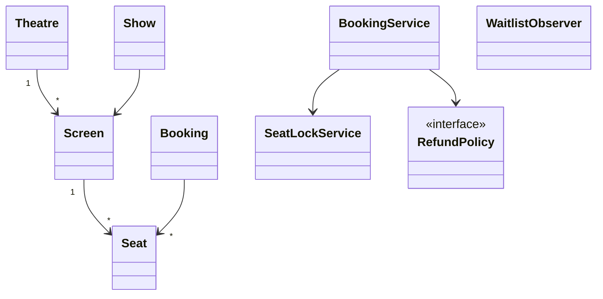
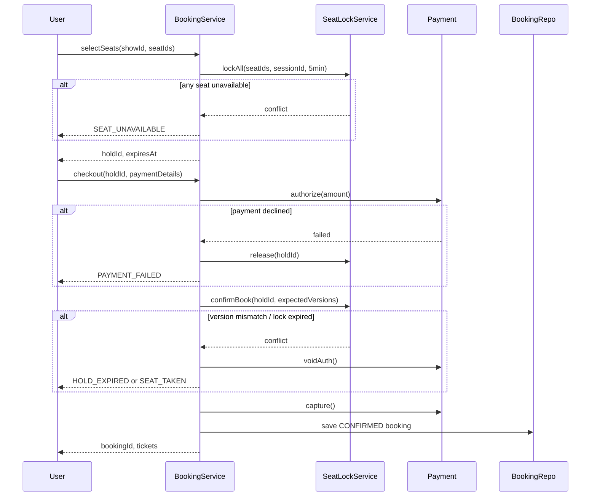
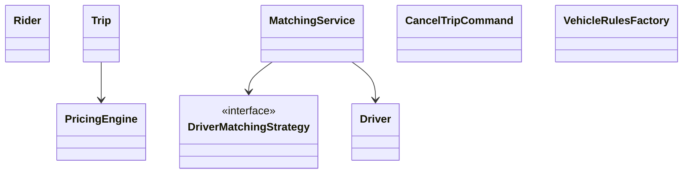

# Day 6 — Movie Tickets + Ride-Sharing + Week 4 Capstone

This day combines **Problem 4.6 (Movie Ticket Booking)** and **Problem 4.7 (Ride-Sharing)**, then closes Week 4 with a capstone review and interviewer-ready framing.

---

# Part A — Movie Ticket Booking

## Learning objectives

- Model shows, screens, seats, booking, and payment flow.
- Handle same-seat contention with lock/timeout semantics.
- Apply State, Strategy, Observer, and optional Composite patterns.

## Clarifying decisions

| Topic | Decision |
|---|---|
| Seat map | Fixed grid per screen; venue metadata can extend layout |
| Hold duration | 5 minutes; auto-release if unpaid |
| Partial booking | No; all-or-nothing seat set |
| Cancellation | Full refund >24h, 50% within 24h, none after show start |
| Waitlist | Trigger on cancellation and inventory increase |

## Core design



## Seat lifecycle and concurrency

```text
AVAILABLE → LOCKED → BOOKED
     ↑          ↓
     └─ timeout / cancel
```

```java
public enum SeatStatus { AVAILABLE, LOCKED, BOOKED }

public final class Seat {
    private SeatStatus status = SeatStatus.AVAILABLE;
    private long version;
    private Instant lockExpiresAt;
    private String lockedBySessionId;

    public boolean tryLock(String sessionId, Duration hold) {
        if (status != SeatStatus.AVAILABLE) return false;
        status = SeatStatus.LOCKED;
        lockedBySessionId = sessionId;
        lockExpiresAt = Instant.now().plus(hold);
        version++;
        return true;
    }

    public void confirmBooked() {
        if (status != SeatStatus.LOCKED) throw new IllegalStateException();
        status = SeatStatus.BOOKED;
        version++;
    }

    public void releaseIfExpired(Instant now) {
        if (status == SeatStatus.LOCKED && now.isAfter(lockExpiresAt)) {
            status = SeatStatus.AVAILABLE;
            lockedBySessionId = null;
            version++;
        }
    }
}
```

**Recommended locking approach:** pessimistic lock during short hold window + optimistic version check at confirm. This gives clear UX under peak contention while still protecting against stale clients.

## Booking flow: select → lock → pay → confirm



## Core service sketch

```java
public final class BookingService {
    private final SeatLockService seatLocks;
    private final PaymentGateway payment;
    private final RefundPolicyFactory refundFactory;
    private final List<WaitlistObserver> waitlistObservers;
    private final BookingRepository bookingRepo;

    public HoldResult lockSeats(String userId, String showId, List<String> seatIds) {
        return seatLocks.lockAll(showId, seatIds, userId, Duration.ofMinutes(5));
    }

    public BookingResult confirm(String userId, String holdId, PaymentDetails details) {
        Hold hold = seatLocks.get(holdId);
        PaymentResult auth = payment.authorize(hold.totalAmount(), details);
        if (!auth.success()) {
            seatLocks.release(holdId);
            return BookingResult.paymentFailed();
        }
        try {
            seatLocks.confirm(holdId);
            payment.capture(auth.id());
            Booking booking = Booking.confirmed(userId, hold);
            bookingRepo.save(booking);
            return BookingResult.success(booking.id());
        } catch (SeatConflictException e) {
            payment.voidAuth(auth.id());
            seatLocks.release(holdId);
            return BookingResult.seatConflict();
        }
    }
}
```

## Patterns in Part A

- **State:** seat transitions
- **Strategy:** refund policy by timing/tier
- **Observer:** waitlist notifications
- **Composite (extension):** seat map tree

---

# Part B — Ride-Sharing App

## Learning objectives

- Model trip lifecycle, matching, pricing, and cancellation.
- Separate matching hot path from pricing hot path.
- Apply Strategy, State, Command, and Observer patterns.

## Clarifying decisions

| Topic | Decision |
|---|---|
| Matching | Nearest available within radius; optional short batch window |
| Surge | Multiplicative on base fare from zone demand metrics |
| Payment | Pre-auth at request, capture on trip completion |
| Route | Single pickup/drop in base model |
| Driver states | OFFLINE, AVAILABLE, ON_TRIP |

## Trip state machine

```text
REQUESTED → DRIVER_ASSIGNED → DRIVER_ARRIVED → TRIP_STARTED → TRIP_COMPLETED
     ↓              ↓
NO_DRIVER      CANCELLED
```

```java
public final class Trip {
    private TripStatus status = TripStatus.REQUESTED;

    public void transition(TripStatus next) {
        if (!TripTransitions.allowed(status, next)) throw new IllegalStateException();
        TripStatus prev = status;
        status = next;
        eventBus.publish(new TripStatusEvent(id, prev, next));
    }
}
```

## Core design



## Matching (Strategy)

```java
public interface DriverMatchingStrategy {
    Optional<Driver> select(TripRequest request, List<Driver> candidates);
}

public final class NearestFirstStrategy implements DriverMatchingStrategy {
    public Optional<Driver> select(TripRequest req, List<Driver> candidates) {
        return candidates.stream()
            .filter(d -> d.status() == DriverStatus.AVAILABLE)
            .filter(d -> d.vehicleType() == req.vehicleType())
            .min(Comparator.comparingDouble(d -> distance(d.location(), req.pickup())));
    }
}
```

```java
public final class MatchingService {
    private final DriverMatchingStrategy strategy;
    private final DriverLocationIndex index;

    public MatchResult match(TripRequest request) {
        List<Driver> nearby = index.withinRadius(request.pickup(), 3.0);
        return strategy.select(request, nearby)
            .map(d -> assign(request, d))
            .orElse(MatchResult.noDriver());
    }

    private MatchResult assign(TripRequest req, Driver d) {
        if (!d.trySetOnTrip()) return MatchResult.raceLost();
        Trip trip = Trip.create(req, d.id());
        trip.transition(TripStatus.DRIVER_ASSIGNED);
        return MatchResult.ok(trip);
    }
}
```

## Pricing engine inputs

```java
public final class TripContext {
    Location pickup;
    Location dropoff;
    VehicleType vehicleType;
    double distanceKm;
    int estimatedMinutes;
    String zoneId;
    Instant requestTime;
}

public final class PricingEngine {
    public FareQuote quote(TripContext ctx) {
        Money base = baseFare(ctx.vehicleType());
        Money distanceComponent = perKmRate(ctx.vehicleType()).multiply(ctx.distanceKm());
        Money timeComponent = perMinRate(ctx.vehicleType()).multiply(ctx.estimatedMinutes());
        double surge = surgeCalculator.multiplier(ctx.zoneId(), ctx.requestTime());
        Money subtotal = base.add(distanceComponent).add(timeComponent);
        Money total = subtotal.multiply(surge).max(minimumFare(ctx.vehicleType()));
        return new FareQuote(subtotal, surge, total);
    }
}
```

Use these inputs for quotes: pickup/dropoff, vehicle type, distance, ETA minutes, zone id, request time, demand metrics, and per-vehicle rate tables.

## Cancel flow (Command)

```java
public final class CancelTripCommand {
    private final String tripId;
    private final String cancelledBy;
    private final TripRepository trips;
    private final DriverRepository drivers;
    private final PaymentGateway payment;
    private final CancellationFeePolicy feePolicy;

    public CancelResult execute() {
        Trip trip = trips.get(tripId);
        if (!trip.canCancel(cancelledBy)) return CancelResult.notAllowed();

        Money fee = feePolicy.fee(trip, cancelledBy);
        trip.transition(TripStatus.CANCELLED);

        Driver driver = drivers.get(trip.driverId());
        if (driver != null) driver.setAvailable();

        payment.voidOrPartialCapture(trip.preAuthId(), fee);
        return CancelResult.ok(fee);
    }
}
```

Rollback/update requirements:

- Trip to `CANCELLED`
- Driver to `AVAILABLE` (if assigned)
- Payment pre-auth voided or partial fee captured
- Rider/driver notified via events

## Patterns in Part B

- **Strategy:** driver matching
- **State:** trip lifecycle
- **Command:** cancellation workflow
- **Observer:** real-time trip updates
- **Factory:** vehicle-specific rules

---

# Part C — Week 4 Capstone

## Review grid (filled)

| # | System | Hardest domain piece | Concurrency / consistency hook |
|---|---|---|---|
| 4.1 | Parking | Spot-vehicle compatibility | Ticket + spot update atomicity |
| 4.2 | Hotel | Date-range inventory | Overlap-safe booking |
| 4.3 | Elevator | Dispatch + scheduling | Shared request queue safety |
| 4.4 | Chess | Check/checkmate correctness | Undo state consistency |
| 4.5 | Food | Order orchestration | Payment vs kitchen compensation |
| 4.6 | Movie | Seat holds | Same-seat race |
| 4.7 | Ride | Match + surge | Stale location handling |
| 4.8 | Library | Copy vs title | FIFO reservation notification |

## Capstone challenge 1: Unified booking kernel

```java
public interface HoldableInventory {
    HoldResult hold(HoldRequest req);
    void release(String holdId);
    ConfirmResult confirm(String holdId);
}

public interface BookingKernel {
    BookingResult holdConfirmPay(
        HoldableInventory inventory,
        HoldRequest hold,
        PaymentDetails payment
    );
}
```

Shared flow is consistent, but inventory semantics differ:

- **Hotel:** quantity across date ranges.
- **Movie:** unique seat IDs for a single show.

## Capstone challenge 2: forbidden food transitions

- `DELIVERED -> PREPARING`
- `PLACED -> OUT_FOR_DELIVERY`
- `CANCELLED -> CONFIRMED`
- `PAYMENT_FAILED -> DELIVERED`

Enforce through a transition table or explicit state guard methods.

---

## Week 4 interviewer prompt template

```text
Act as a FAANG interviewer. I'm solving an LLD problem.

Problem: [Design a Movie Ticket Booking System]

I'll design it step by step:
1. First I'll clarify requirements — correct any wrong assumptions
2. Then I'll list the core entities — point out missing ones
3. Then I'll draw the class hierarchy — highlight bad inheritance decisions
4. Then I'll apply design patterns — challenge me if a pattern is forced
5. Then I'll walk through a seat booking flow — point out race conditions or edge cases

After I'm done, score my design 1–10 on: correctness, extensibility, pattern usage, edge case handling.
Give specific improvement suggestions.
```

Reuse the same structure for any Week 4 system by changing the problem statement and step-5 flow.

---

## Week 4 to Week 5 bridge

Carry forward these production stories into low-level concurrency topics:

- Seat/inventory holds -> locks, transactions, idempotent confirm.
- Ride matching -> stale reads, CAS assignment, read-heavy structures.

---

## Self-quiz with answers

1. **What should movie booking return on optimistic conflict?**  
   Return HTTP `409` / domain `SEAT_CONFLICT`, include conflicting seat IDs when possible, and void payment authorization.

2. **Why keep PricingEngine separate from MatchingService?**  
   They have different inputs, update frequencies, and scaling behavior. Matching is real-time geo-state heavy; pricing is deterministic math over cached policy and demand signals.

3. **When is Singleton a bad interview signal here?**  
   When used as global mutable state for domain logic (hard to test, hard to shard by city/theatre, and often not thread-safe). Prefer DI-managed scoped services.

---

## First three tests per system

**Movie**
1. Two sessions lock same seat -> only one succeeds.
2. Hold expires -> seat returns to `AVAILABLE`; confirm fails.
3. Payment failure -> all locked seats are released.

**Ride**
1. No eligible driver in radius -> `NO_DRIVER_AVAILABLE`.
2. Cancel after assign -> driver returns to `AVAILABLE`; auth voided/fee handled.
3. Invalid transition (`REQUESTED -> TRIP_STARTED`) is rejected.

---

Week 4 is complete. Use this document as a mock-interview script for both design narration and tradeoff defense.
