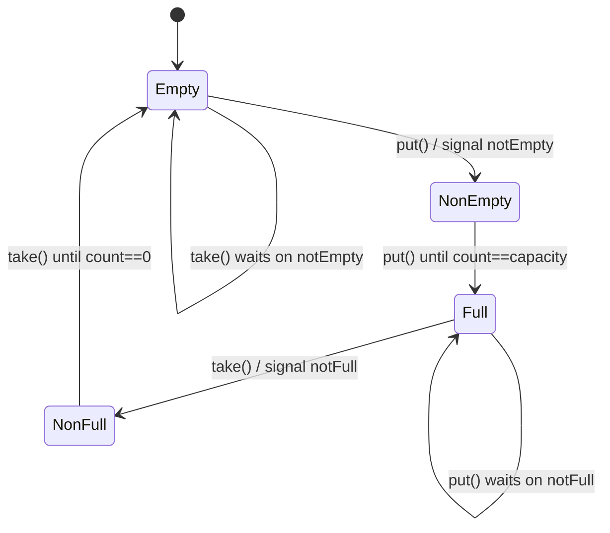

# Day 3 — Producer-Consumer and Blocking Queue

This lesson covers bounded buffers, lock/condition coordination, and how the same primitive powers executors and async logging.

---

## Learning objectives

- Define `BlockingQueue<T>` behavior (`put` blocks when full, `take` blocks when empty).
- Implement a bounded queue with circular buffer + `ReentrantLock` + `Condition`.
- Reuse the queue design in a task executor and async log appender.

---

## Core semantics

| Method | Behavior |
|---|---|
| `put(item)` | Waits until space is available, then enqueues |
| `take()` | Waits until an item is available, then dequeues |
| `size()` | Returns current count (exact if protected by same lock) |
| `offer(item, timeout)` | Optional timeout-based enqueue |
| `poll(timeout)` | Optional timeout-based dequeue |

Invariant: `0 <= count <= capacity` always.

---

## Problem 1 — Build `ArrayBlockingQueue<T>` from scratch

### Circular buffer model

```text
capacity = 4
items: [A, B, _, _]
head = 0, tail = 2, count = 2

put(C): items[2] = C; tail = 3; count = 3
take(): read items[head]; head = 1; count = 2
```

### Implementation

```java
public final class ArrayBlockingQueue<T> {
    private final Object[] items;
    private final int capacity;
    private int head;
    private int tail;
    private int count;

    private final ReentrantLock lock = new ReentrantLock();
    private final Condition notEmpty = lock.newCondition();
    private final Condition notFull = lock.newCondition();

    public ArrayBlockingQueue(int capacity) {
        if (capacity <= 0) throw new IllegalArgumentException();
        this.capacity = capacity;
        this.items = new Object[capacity];
    }

    public void put(T item) throws InterruptedException {
        lock.lock();
        try {
            while (count == capacity) {
                notFull.await();
            }
            items[tail] = item;
            tail = (tail + 1) % capacity;
            count++;
            notEmpty.signal();
        } finally {
            lock.unlock();
        }
    }

    @SuppressWarnings("unchecked")
    public T take() throws InterruptedException {
        lock.lock();
        try {
            while (count == 0) {
                notEmpty.await();
            }
            T item = (T) items[head];
            items[head] = null;
            head = (head + 1) % capacity;
            count--;
            notFull.signal();
            return item;
        } finally {
            lock.unlock();
        }
    }

    public int size() {
        lock.lock();
        try {
            return count;
        } finally {
            lock.unlock();
        }
    }

    public boolean offer(T item, long timeout, TimeUnit unit) throws InterruptedException {
        lock.lock();
        try {
            long nanos = unit.toNanos(timeout);
            while (count == capacity) {
                if (nanos <= 0) return false;
                nanos = notFull.awaitNanos(nanos);
            }
            items[tail] = item;
            tail = (tail + 1) % capacity;
            count++;
            notEmpty.signal();
            return true;
        } finally {
            lock.unlock();
        }
    }

    @SuppressWarnings("unchecked")
    public T poll(long timeout, TimeUnit unit) throws InterruptedException {
        lock.lock();
        try {
            long nanos = unit.toNanos(timeout);
            while (count == 0) {
                if (nanos <= 0) return null;
                nanos = notEmpty.awaitNanos(nanos);
            }
            T item = (T) items[head];
            items[head] = null;
            head = (head + 1) % capacity;
            count--;
            notFull.signal();
            return item;
        } finally {
            lock.unlock();
        }
    }
}
```

### Why this is correct

- `while` guards against spurious wakeups and races after wakeup.
- State changes happen before `signal()`.
- `head`, `tail`, and `count` mutate under one lock.

### Common broken patterns

- Using `if` instead of `while` around `await`.
- Updating `count` outside lock.
- Signaling before state update.
- Calling `wait/notify` without owning monitor (legacy style bug).

---

## Slot/queue state intuition



---

## Interrupt handling rule

If `await()` is interrupted:

- Let `InterruptedException` propagate when API allows it.
- If catching internally, restore interrupt flag (`Thread.currentThread().interrupt()`).
- Always unlock in `finally`.

---

## Problem 2 — `TaskExecutor` (simplified thread pool)

Use producer-consumer:

- Producers call `submit(Runnable)` into bounded queue.
- Worker threads repeatedly dequeue and run tasks.
- Shutdown stops accepting work and drains/interrupts per policy.

```java
public final class TaskExecutor {
    private final ArrayBlockingQueue<Runnable> queue;
    private final List<Worker> workers = new ArrayList<>();
    private volatile boolean shutdown;

    public TaskExecutor(int workerCount, int queueCapacity) {
        this.queue = new ArrayBlockingQueue<>(queueCapacity);
        for (int i = 0; i < workerCount; i++) {
            Worker w = new Worker();
            workers.add(w);
            w.start();
        }
    }

    public void submit(Runnable task) throws InterruptedException {
        if (shutdown) throw new RejectedExecutionException("executor is shutdown");
        queue.put(task);
    }

    public void shutdown() {
        shutdown = true;
        for (Worker w : workers) w.interrupt();
    }

    private final class Worker extends Thread {
        @Override
        public void run() {
            while (!shutdown || queue.size() > 0) {
                try {
                    Runnable task = queue.poll(200, TimeUnit.MILLISECONDS);
                    if (task != null) task.run();
                } catch (InterruptedException e) {
                    if (shutdown) break;
                } catch (Exception e) {
                    // isolate task failure; continue loop
                }
            }
        }
    }
}
```

Graceful shutdown options:

- Interrupt workers.
- Poison-pill task per worker.
- Drain queue before termination.

---

## Problem 3 — `LogAsyncAppender`

Keep app threads fast by moving I/O to drainer thread.

```java
public final class LogAsyncAppender {
    private final ArrayBlockingQueue<LogRecord> queue;
    private final Thread drainer;
    private volatile boolean running = true;

    public LogAsyncAppender(int capacity) {
        this.queue = new ArrayBlockingQueue<>(capacity);
        this.drainer = new Thread(this::drainLoop, "log-drainer");
        this.drainer.setDaemon(true);
        this.drainer.start();
    }

    public void append(LogRecord record) throws InterruptedException {
        boolean accepted = queue.offer(record, 10, TimeUnit.MILLISECONDS);
        if (!accepted) {
            // policy: drop/sample/fallback
            System.err.println("LOG_DROPPED: " + record.message());
        }
    }

    private void drainLoop() {
        while (running || queue.size() > 0) {
            try {
                LogRecord r = queue.poll(500, TimeUnit.MILLISECONDS);
                if (r != null) writeToSink(r);
            } catch (InterruptedException ignored) {
                if (!running) break;
            }
        }
    }
}
```

Backpressure policy choices:

- `put` (block producer): safer for audit-critical logs.
- timed `offer`: preferred for high-throughput app logging.
- drop oldest or sample: useful under flood conditions.

---

## Producer-consumer vs pipeline

- Producer-consumer: one queue between producers and consumers.
- Pipeline: multiple queues between staged consumers/producers.
- Same primitive, different composition.

---

## `LinkedBlockingQueue` vs array queue

| Aspect | Array-based | Linked-based |
|---|---|---|
| Memory | Fixed | Can grow (if configured large/unbounded) |
| Burst handling | Must size upfront | Better for unknown burst shapes |
| Cache locality | Better | Worse (pointer chasing) |
| LLD implementability | Easier to reason with circular buffer | Usually mention as alternative |

---

## Self-quiz with answers

1. **Why must `await` be in a `while` loop?**  
   Spurious wakeups are allowed, and condition may become false again before thread reacquires lock.

2. **Producer-consumer vs pipeline — different primitive?**  
   Same primitive (`BlockingQueue`); pipeline just chains stages with queues.

3. **Why choose linked queue sometimes?**  
   Better flexibility for variable burst sizes when fixed capacity is hard to pre-estimate.

---

## First three tests

1. Capacity test: once full, producer blocks until a `take`.
2. FIFO test: enqueue A, B, C and dequeue order remains A, B, C.
3. Shutdown test: executor rejects new submissions after shutdown and workers exit cleanly.

---

## Interview sound bites

- "`while` around `await` is non-negotiable."
- "Bounded queue is an explicit backpressure contract."
- "Signal after state mutation."
- "Async logging should not block critical business path indefinitely."

---

## Day 3 checkpoint

- [x] Blocking queue semantics and invariants
- [x] Queue implementation with lock + conditions
- [x] TaskExecutor worker model and shutdown choices
- [x] Async appender backpressure strategies
- [x] Self-quiz and validation tests

**Next:** `Day-04-Object-Pool-Pattern.md`
