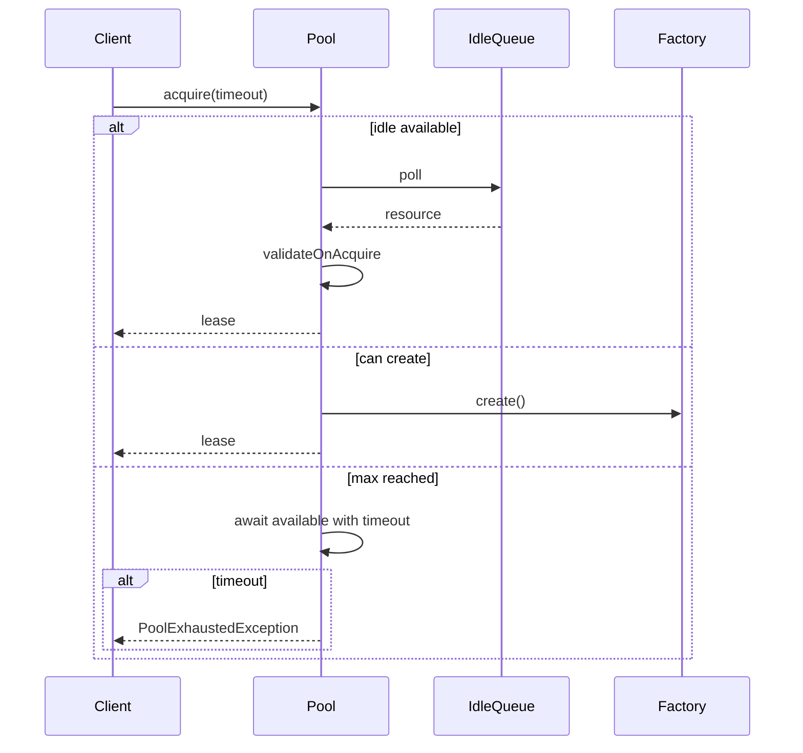

# Day 4 — Object Pool Pattern

This lesson focuses on reusing expensive objects safely under concurrency, with limits, timeouts, and idle shrink rules.

---

## Learning objectives

- Define correct `acquire()` and `release()` contracts.
- Model `minSize`, `maxSize`, acquire timeout, and idle eviction.
- Prevent leaks and broken-resource reuse with lease and validation patterns.

---

## Core contracts

```java
public interface Pool<T> {
    PoolLease<T> acquire(Duration timeout)
        throws PoolExhaustedException, InterruptedException;
    void release(T resource);
    void shutdown();
}

public final class PoolLease<T> implements AutoCloseable {
    private final T resource;
    private final Pool<T> pool;
    private boolean closed;

    PoolLease(T resource, Pool<T> pool) {
        this.resource = resource;
        this.pool = pool;
    }

    public T get() {
        return resource;
    }

    @Override
    public void close() {
        if (!closed) {
            closed = true;
            pool.release(resource);
        }
    }
}
```

Usage:

```java
try (PoolLease<Connection> lease = pool.acquire(Duration.ofSeconds(5))) {
    Connection conn = lease.get();
    // use connection
}
```

This ensures release even during failures.

---

## Generic pool model

- Idle resources are kept in an internal queue.
- `totalCreated` never exceeds `maxSize`.
- At max and no idle object: wait for release or timeout.
- Idle evictor shrinks only idle resources above `minSize`.



---

## Problem 1 — `DatabaseConnectionPool`

### Config

```java
public record PoolConfig(
    int minSize,
    int maxSize,
    Duration acquireTimeout,
    Duration idleEvictAfter,
    String jdbcUrl
) {
    public PoolConfig {
        if (minSize < 0 || maxSize < minSize) {
            throw new IllegalArgumentException("Invalid pool limits");
        }
    }
}
```

### Implementation sketch

```java
public final class DatabaseConnectionPool implements Pool<Connection> {
    private final PoolConfig config;
    private final BlockingQueue<PooledConnection> idle = new LinkedBlockingQueue<>();
    private final ReentrantLock lock = new ReentrantLock();
    private final Condition available = lock.newCondition();
    private int totalCreated;
    private volatile boolean shuttingDown;

    public DatabaseConnectionPool(PoolConfig config) {
        this.config = config;
        for (int i = 0; i < config.minSize(); i++) {
            idle.offer(wrap(createPhysical()));
            totalCreated++;
        }
        startIdleEvictor();
    }

    @Override
    public PoolLease<Connection> acquire(Duration timeout)
            throws PoolExhaustedException, InterruptedException {
        long deadline = System.nanoTime() + timeout.toNanos();
        lock.lock();
        try {
            while (true) {
                PooledConnection pc = idle.poll();
                if (pc != null) {
                    if (validateOnAcquire(pc)) {
                        pc.markInUse();
                        return new PoolLease<>(pc.proxy(), this);
                    }
                    destroy(pc);
                    totalCreated--;
                    continue;
                }

                if (totalCreated < config.maxSize()) {
                    PooledConnection fresh = wrap(createPhysical());
                    totalCreated++;
                    fresh.markInUse();
                    return new PoolLease<>(fresh.proxy(), this);
                }

                long remaining = deadline - System.nanoTime();
                if (remaining <= 0) {
                    throw new PoolExhaustedException();
                }
                available.awaitNanos(remaining);
            }
        } finally {
            lock.unlock();
        }
    }

    @Override
    public void release(Connection proxy) {
        PooledConnection pc = unwrap(proxy);
        lock.lock();
        try {
            if (shuttingDown) {
                destroy(pc);
                totalCreated--;
                return;
            }
            resetSession(pc);
            if (!validateOnRelease(pc)) {
                destroy(pc);
                totalCreated--;
            } else {
                pc.markIdle();
                idle.offer(pc);
                available.signal();
            }
        } finally {
            lock.unlock();
        }
    }
}
```

Acquire under max-load behavior:

- If `totalCreated == maxSize` and no idle resource exists, callers block.
- If timeout elapses, throw `PoolExhaustedException`.
- No unbounded resource creation.

### Idle shrink and race safety

Run periodic evictor under the same lock used by acquire/release:

- Evict only from idle queue.
- Never touch in-use resources.
- Keep `totalCreated >= minSize`.

---

## Problem 2 — `HttpClientPool`

Important clarification:

- Often you pool a few `HttpClient` instances.
- Each client may internally manage connection pooling/multiplexing.

```java
public final class HttpClientPool implements Pool<HttpClient> {
    private final GenericObjectPool<HttpClient> delegate;

    public HttpClientPool(int maxClients) {
        this.delegate = new GenericObjectPool<>(
            () -> HttpClient.newBuilder()
                .connectTimeout(Duration.ofSeconds(5))
                .build(),
            maxClients
        );
    }
}
```

On repeated I/O failures, invalidate and recreate rather than recycling the same broken client.

---

## Problem 3 — `WorkerThreadPool` vs resource pool

Both use queues, but pool different things:

| Type | Pooled object |
|---|---|
| Resource pool | DB connection / HTTP client |
| Worker pool | Threads consuming `Runnable` tasks |

Worker pool concept (from Day 3): fixed workers + blocking queue + submit/shutdown lifecycle.

---

## Pitfalls and mitigations

| Pitfall | Mitigation |
|---|---|
| Caller forgets `release` | `PoolLease` + try-with-resources |
| Broken object returned to pool | Validate and `invalidate()` |
| Silent unbounded growth | Strict `maxSize` and timeout |
| Idle bloat | Evict idle entries above `minSize` |
| Starvation/coldness tradeoff | FIFO (fairness) vs LIFO (warmth) choice |

---

## Object pool vs Flyweight

| Object Pool | Flyweight |
|---|---|
| Reuses heavy mutable runtime objects | Shares intrinsic immutable state |
| Caller checks out and returns | Caller typically does not own instance lifecycle |
| Concerned with exhaustion/leaks/timeouts | Concerned with memory footprint |

---

## Self-quiz with answers

1. **Why validate DB connection on acquire, not only release?**  
   Connections can go stale while idle (network/database timeout). Acquire-time validation prevents handing dead connections to callers.

2. **How is object pool different from Flyweight?**  
   Pool manages scarce mutable resources with checkout/return semantics; Flyweight shares immutable data across many logical objects.

3. **Pool at max and all objects checked out — caller options?**  
   Block until timeout, fail fast with clear error, or increase capacity operationally. Never exceed max silently.

---

## First three tests

1. Leak scenario: acquire up to max without release, next acquire times out.
2. Release path: closing lease returns resource and unblocks waiting acquire.
3. Broken resource path: invalid resource on release is destroyed, and a fresh one is created on next demand.

---

## Interview sound bites

- "Use lease + try-with-resources to prevent pool leaks."
- "Validate on checkout because idle resources can die."
- "`maxSize` is a safety boundary, not a hint."
- "Worker pool and connection pool both use queues, but pool different objects."

---

## Day 4 checkpoint

- [x] Generic pool + lease contract
- [x] DB pool with min/max, timeout, reset, validation, and shrink
- [x] HTTP client pooling tradeoff clarity
- [x] Worker pool vs resource pool distinction
- [x] Self-quiz and test checklist

**Next:** `Day-05-Thread-Safe-LRU-LFU-Cache.md`
