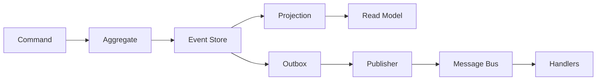
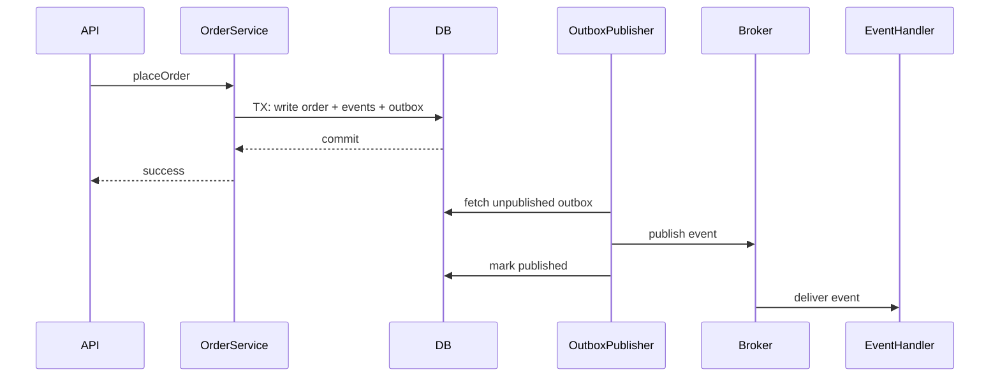

# Day 1 — Event-Driven Architecture Patterns

This lesson unifies event sourcing, CQRS, outbox, and saga into one production-style design flow.

---

## Learning objectives

- Distinguish event sourcing from CRUD snapshot design.
- Separate write and read paths using CQRS.
- Guarantee reliable publish with outbox (without dual-write races).
- Model distributed consistency with saga and compensation.

---

## Pattern overview

| Pattern | Primary benefit |
|---|---|
| Event sourcing | Replay, auditability, temporal debugging |
| CQRS | Independent write/read modeling and scaling |
| Outbox | Reliable at-least-once publish after DB commit |
| Saga | Multi-service consistency without 2PC |



---

## Core building blocks

```java
public interface DomainEvent {
    String eventId();
    String aggregateId();
    String type();
    long version();
    Instant occurredAt();
    Map<String, Object> payload();
}

public interface EventStore {
    void append(String aggregateId, long expectedVersion, List<DomainEvent> events);
    List<DomainEvent> load(String aggregateId);
}

public interface Projection {
    void apply(DomainEvent event);
}
```

Key responsibilities:

- Aggregate enforces invariants and emits events.
- Event store provides append/load stream semantics.
- Projections build read models from event stream.

---

## Problem 1 — `OrderAggregate` with event sourcing

### Event set

- `OrderPlaced`
- `OrderConfirmed`
- `OrderShipped`
- `OrderCancelled`

### Rehydrate and enforce transitions

```java
public enum OrderStatus { PLACED, CONFIRMED, SHIPPED, CANCELLED }

public final class OrderAggregate {
    private String orderId;
    private OrderStatus status;
    private long version;

    public static OrderAggregate rehydrate(List<DomainEvent> events) {
        OrderAggregate agg = new OrderAggregate();
        for (DomainEvent e : events) agg.apply(e);
        return agg;
    }

    private void apply(DomainEvent e) {
        switch (e.type()) {
            case "OrderPlaced" -> status = OrderStatus.PLACED;
            case "OrderConfirmed" -> status = OrderStatus.CONFIRMED;
            case "OrderShipped" -> status = OrderStatus.SHIPPED;
            case "OrderCancelled" -> status = OrderStatus.CANCELLED;
            default -> throw new IllegalArgumentException("Unknown event: " + e.type());
        }
        version++;
    }

    public List<DomainEvent> confirm() {
        if (status != OrderStatus.PLACED) throw new InvalidTransitionException();
        return List.of(new OrderConfirmed(orderId));
    }

    public List<DomainEvent> ship(String trackingId) {
        if (status != OrderStatus.CONFIRMED) throw new InvalidTransitionException();
        return List.of(new OrderShipped(orderId, trackingId));
    }

    public List<DomainEvent> cancel(String reason) {
        if (status == OrderStatus.SHIPPED || status == OrderStatus.CANCELLED) {
            throw new InvalidTransitionException();
        }
        return List.of(new OrderCancelled(orderId, reason));
    }
}
```

Optimistic concurrency:

- Load stream and compute `expectedVersion`
- Append with expected version check
- If mismatch, return conflict/retry

---

## Problem 2 — CQRS `UserService`

Write side handles commands and invariants; read side serves denormalized query model.

```java
public final class UserCommandService {
    @Transactional
    public void rename(RenameUser cmd) {
        User user = writeRepo.get(cmd.userId());
        user.rename(cmd.newName());
        writeRepo.save(user);
        DomainEvent evt = new UserRenamed(cmd.userId(), cmd.newName());
        eventStore.append(cmd.userId(), user.version(), List.of(evt));
        outboxRepo.insert(OutboxRow.from(evt));
    }
}

public final class UserQueryService {
    public UserReadModel getById(String userId) {
        return readRepo.findById(userId);
    }
}
```

Projection example:

```java
public final class UserProjection implements Projection {
    @Override
    public void apply(DomainEvent event) {
        switch (event.type()) {
            case "UserCreated" -> readRepo.insert(...);
            case "UserRenamed" -> readRepo.updateName(...);
            case "UserDeactivated" -> readRepo.setActive(...);
            default -> { }
        }
    }
}
```

Sync vs async projection:

- Sync: immediate consistency, slower writes.
- Async: faster writes, eventual consistency lag.

---

## Problem 3 — Outbox pattern

### Schema sketch

```sql
CREATE TABLE outbox (
  id UUID PRIMARY KEY,
  aggregate_id VARCHAR NOT NULL,
  event_type VARCHAR NOT NULL,
  payload JSON NOT NULL,
  created_at TIMESTAMP NOT NULL,
  published_at TIMESTAMP NULL
);
```

### Transaction flow

1. Persist business state/event in DB.
2. Insert outbox row in same transaction.
3. Commit.
4. Background publisher publishes and marks row as published.

```java
public final class OutboxPublisher implements Runnable {
    public void run() {
        List<OutboxRow> batch = outboxRepo.fetchUnpublished(100);
        for (OutboxRow row : batch) {
            try {
                broker.publish(row.eventType(), row.payload());
                outboxRepo.markPublished(row.id());
            } catch (Exception e) {
                // retry later (at-least-once)
            }
        }
    }
}
```

Consumer idempotency is required (dedupe by `eventId` or naturally idempotent behavior).

---

## Place-order sequence (deliverable)



---

## Saga example (happy + failure)

Happy path:

1. Order placed
2. Inventory reserved
3. Payment captured
4. Order confirmed

Failure path (payment fails after inventory reserve):

1. `PaymentFailed` event
2. Compensate: release inventory
3. Mark order cancelled

Orchestration vs choreography:

- Orchestration: central coordinator, easier flow tracing.
- Choreography: event-driven autonomy, harder global debugging.

---

## When CQRS is overkill

For small CRUD services with modest traffic and simple query patterns, CQRS adds projection lag, operational complexity, and dual-model maintenance without clear benefit.

---

## Self-quiz with answers

1. **Why is “update DB then send Kafka” unsafe?**  
   Because DB commit and broker publish are separate failure domains; one can succeed without the other.

2. **How to protect against duplicate event delivery?**  
   Use idempotent handlers and dedupe tracking (`processed_events` by `eventId`).

3. **What breaks if old events are deleted in event sourcing?**  
   Replay, audits, and rebuilding new projections become impossible/incomplete.

---

## First three tests

1. Replay order events and verify final status is correct.
2. Invalid transition (ship after cancel) is rejected.
3. Outbox recovery: crash after commit before publish still results in eventual publish.

---

## Interview sound bites

- "Outbox solves dual-write risk with at-least-once semantics."
- "CQRS improves model fit, but introduces eventual-consistency tradeoffs."
- "Sagas compensate; they do not rollback globally across services."
- "Event sourcing needs versioned streams and optimistic concurrency."

---

## Day 1 checkpoint

- [x] Event sourcing aggregate + replay + version checks
- [x] CQRS command/query split + projection behavior
- [x] Outbox transactional publish flow
- [x] Saga compensation example
- [x] Self-quiz and practical tests

**Next:** `Day-02-Pub-Sub-Event-Bus.md`
