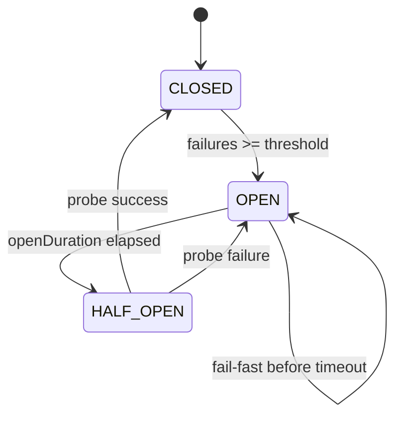
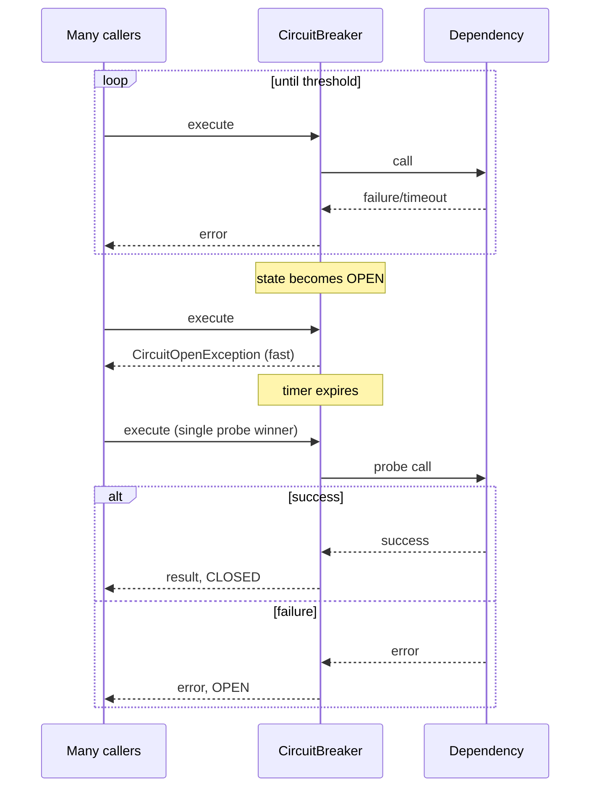

# Day 3 — Circuit Breaker Pattern

This lesson covers fail-fast resilience with a circuit-breaker state machine, thread-safe transitions, half-open probing, and wrapper integration via proxy/decorator.

---

## Learning objectives

- Implement `CLOSED -> OPEN -> HALF_OPEN -> CLOSED` (or back to OPEN on failed probe).
- Enforce failure thresholds and open-duration gating.
- Prevent half-open herd behavior with single-probe control.
- Add metrics and integration wrappers for real service calls.

---

## State model

| State | Behavior |
|---|---|
| CLOSED | Calls pass through, failures are tracked |
| OPEN | Calls fail fast without downstream invocation |
| HALF_OPEN | Limited probe calls decide recovery or reopen |



Timeouts are treated as failures in this design.

---

## Transition table (deliverable)

| Current | Result | Next |
|---|---|---|
| CLOSED | Success | CLOSED |
| CLOSED | Failure below threshold | CLOSED |
| CLOSED | Failure reaches threshold | OPEN |
| OPEN | Any call before timeout | OPEN (reject) |
| OPEN | Timeout elapsed | HALF_OPEN |
| HALF_OPEN | Probe success | CLOSED |
| HALF_OPEN | Probe failure | OPEN |

---

## Thread-safe `CircuitBreaker<T>`

```java
public enum BreakerState { CLOSED, OPEN, HALF_OPEN }

public record CircuitBreakerConfig(
    int failureThreshold,
    long openStateDurationMs,
    int halfOpenPermits
) {}

public final class CircuitBreaker<T> {
    private final CircuitBreakerConfig config;
    private final CircuitBreakerMetrics metrics;
    private final ReentrantLock lock = new ReentrantLock();
    private final Semaphore halfOpenSemaphore;

    private BreakerState state = BreakerState.CLOSED;
    private int consecutiveFailures = 0;
    private long openedAtEpochMs = 0L;

    public CircuitBreaker(CircuitBreakerConfig config, CircuitBreakerMetrics metrics) {
        this.config = config;
        this.metrics = metrics;
        this.halfOpenSemaphore = new Semaphore(config.halfOpenPermits());
    }

    public T execute(Callable<T> action) throws Exception {
        metrics.recordCall();
        if (!allowCall()) {
            metrics.recordRejected();
            throw new CircuitOpenException("circuit is OPEN");
        }

        try {
            T result = action.call();
            onSuccess();
            return result;
        } catch (Exception e) {
            onFailure();
            throw e;
        }
    }

    private boolean allowCall() {
        lock.lock();
        try {
            long now = System.currentTimeMillis();
            if (state == BreakerState.CLOSED) return true;
            if (state == BreakerState.OPEN) {
                if (now - openedAtEpochMs < config.openStateDurationMs()) return false;
                transitionTo(BreakerState.HALF_OPEN);
                halfOpenSemaphore.drainPermits();
                halfOpenSemaphore.release(config.halfOpenPermits());
            }
        } finally {
            lock.unlock();
        }
        return halfOpenSemaphore.tryAcquire(); // half-open probe gate
    }

    private void onSuccess() {
        lock.lock();
        try {
            consecutiveFailures = 0;
            if (state == BreakerState.HALF_OPEN) transitionTo(BreakerState.CLOSED);
        } finally {
            lock.unlock();
            if (state == BreakerState.HALF_OPEN) halfOpenSemaphore.release();
        }
    }

    private void onFailure() {
        lock.lock();
        try {
            consecutiveFailures++;
            if (state == BreakerState.HALF_OPEN ||
                (state == BreakerState.CLOSED && consecutiveFailures >= config.failureThreshold())) {
                openedAtEpochMs = System.currentTimeMillis();
                transitionTo(BreakerState.OPEN);
            }
        } finally {
            lock.unlock();
        }
    }

    private void transitionTo(BreakerState next) {
        if (state != next) {
            metrics.recordTransition(state, next);
            state = next;
        }
    }

    public BreakerState state() {
        lock.lock();
        try { return state; } finally { lock.unlock(); }
    }
}
```

---

## Half-open single probe pseudocode (deliverable)

```text
if state == OPEN and timer elapsed:
  transition to HALF_OPEN

if state == HALF_OPEN:
  if !probePermit.tryAcquire(): reject fast
  else run one probe call
       success -> CLOSED
       failure -> OPEN
```

This avoids the thundering-herd probe spike when open-duration expires.

---

## Sequence under dependency outage (deliverable)



---

## Metrics model

```java
public final class CircuitBreakerMetrics {
    private final LongAdder totalCalls = new LongAdder();
    private final LongAdder failedCalls = new LongAdder();
    private final LongAdder rejectedCalls = new LongAdder();
    private final List<StateTransition> transitions =
        Collections.synchronizedList(new ArrayList<>());

    public void recordCall() { totalCalls.increment(); }
    public void recordFailure() { failedCalls.increment(); }
    public void recordRejected() { rejectedCalls.increment(); }

    public void recordTransition(BreakerState from, BreakerState to) {
        transitions.add(new StateTransition(from, to, Instant.now()));
    }
}

public record StateTransition(BreakerState from, BreakerState to, Instant at) {}
```

Useful dashboards: rejected rate, current state, transition frequency, half-open success ratio.

---

## Service wrapper patterns

### Dynamic proxy approach

```java
public final class ServiceProxyFactory {
    public static <T> T wrap(T target, Class<T> iface, CircuitBreaker<?> breaker) {
        return iface.cast(Proxy.newProxyInstance(
            iface.getClassLoader(),
            new Class<?>[] { iface },
            (proxy, method, args) -> breaker.execute(() -> method.invoke(target, args))
        ));
    }
}
```

### Explicit decorator approach

```java
public final class ResilientPaymentClient implements PaymentClient {
    private final PaymentClient delegate;
    private final CircuitBreaker<PaymentResult> breaker;

    @Override
    public PaymentResult charge(ChargeRequest request) {
        try {
            return breaker.execute(() -> delegate.charge(request));
        } catch (CircuitOpenException e) {
            return PaymentResult.failFast("payment dependency unavailable");
        } catch (Exception e) {
            throw new RuntimeException(e);
        }
    }
}
```

---

## Circuit breaker vs retry

- Retry handles transient failures.
- Circuit breaker handles sustained failure patterns.
- When breaker is OPEN, retries should be suppressed to avoid storming dead dependencies.

Common composition: `CircuitBreaker(Retry(DownstreamCall))`.

---

## Self-quiz with answers

1. **Why fail-fast in OPEN instead of blocking?**  
   It frees threads/resources quickly and prevents cascading latency collapse.

2. **What if 10 half-open probes run at once?**  
   They can overwhelm a recovering dependency and reopen breaker immediately; single-probe gating prevents this.

3. **When should breaker suppress retries?**  
   During OPEN state, and typically during overload signals where retry amplification is harmful.

---

## First three tests

1. Threshold test: N failures transition CLOSED -> OPEN, next call rejects without invoking dependency.
2. Recovery test: after open duration, successful probe transitions HALF_OPEN -> CLOSED.
3. Herd test: many concurrent calls at half-open permit only one probe execution.

---

## Interview sound bites

- "OPEN means fail-fast, not wait."
- "HALF_OPEN should usually allow one probe."
- "Timeouts count as failures."
- "Breaker protects both caller and dependency."

---

## Day 3 checkpoint

- [x] State machine and transition logic
- [x] Thread-safe execute path
- [x] Half-open probe control
- [x] Metrics and wrapper integration
- [x] Retry interaction and tests

**Next:** `Day-04-Retry-and-Backoff.md`
